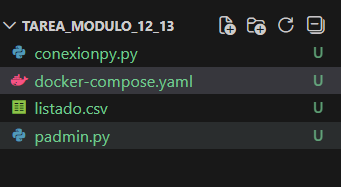
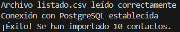
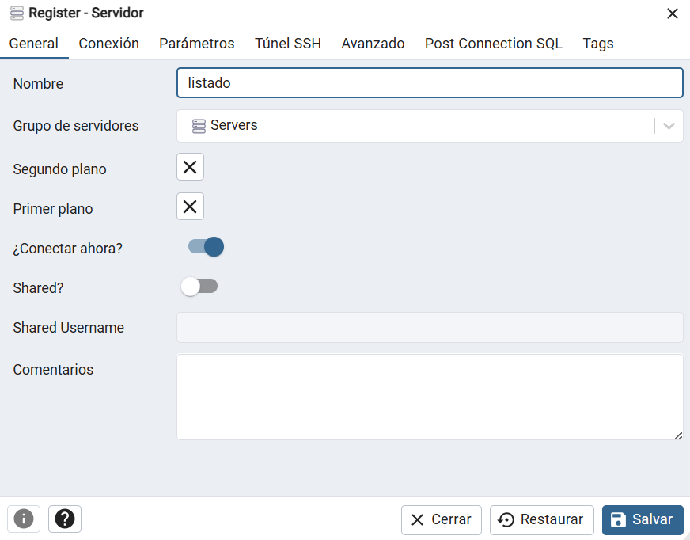
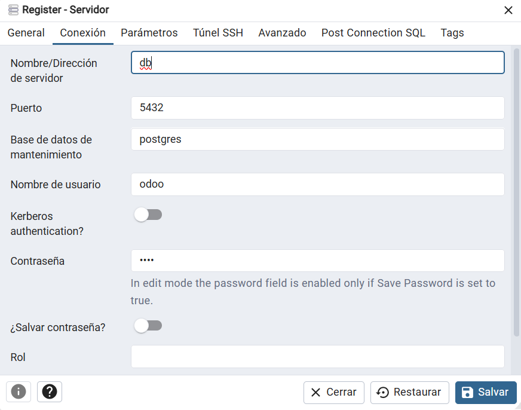

# Tarea – Módulo 12-13: Proyecto de Conexión y Administración

## 🧠 Descripción general
Este proyecto forma parte del módulo **Sistemas de Gestión Empresarial** y contiene código en Python para conectarse a una fuente de datos y realizar tareas de análisis o administración de registros. Además presenta un archivo de datos (`listado.csv`) y una configuración Docker para facilitar la ejecución del entorno.

---

## 📁 Estructura del proyecto

| Archivo | Descripción |
|---------|-------------|
| `conexionpy.py` | Script principal en Python que realiza conexión y procesamiento de datos. |
| `padmin.py` | Código adicional de administración/salida de datos. |
| `listado.csv` | Datos de ejemplo utilizados por los scripts. |
| `docker-compose.yaml` | Configuración para contenerizar y ejecutar servicios si aplica. |

---

## 🧪 ¿Qué hace el proyecto?

### 📌 `conexionpy.py`
Este script:
- Importa librerías como `pandas` para manejo de datos.
- Carga el archivo `listado.csv`.
- Procesa la información (leer, filtrar, mostrar estadísticas, etc.).
- Establece conexión si se trabaja con base de datos (PostgreSQL).

### 🧰 padmin.py
Este módulo complementario realiza tareas de administración o visualización de los datos cargados.

### 📦 listado.csv
Este archivo contiene datos estructurados en columnas (por ejemplo: nombre, edad, etc.). Se utiliza como dataset de prueba para el análisis en Python.

### 🐳 Docker
El archivo docker-compose.yaml puede usarse para levantar servicios necesarios para el proyecto.

---

## ✅ Resultados

Al ejecutar el archivo principal, el sistema carga correctamente el archivo `listado.csv`, procesa los datos y muestra la información correspondiente en consola.
Estos resultados también podemos verlos desde pgadmin y comprobando que el archivo ha añadido los contactos.

